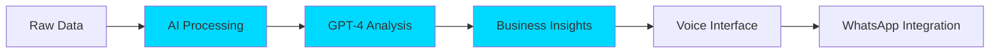
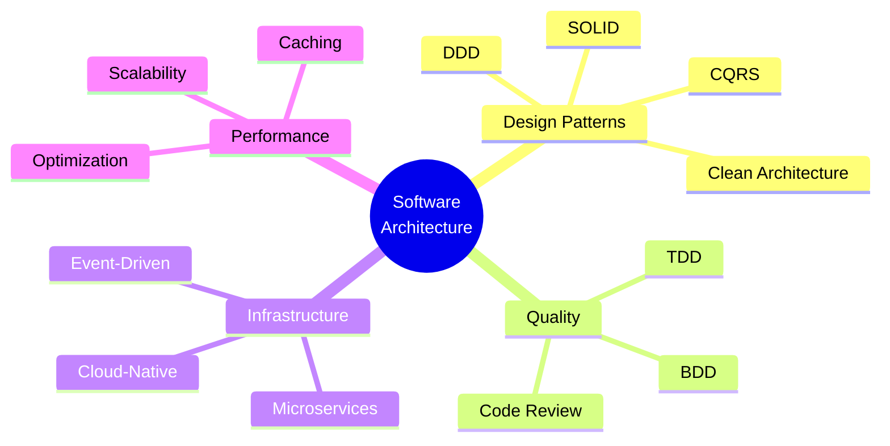

<div align="center">  
# 👨‍💻 Anderson Migloranza

[](https://git.io/typing-svg)


</div>

---

## 🎯 About Me

```typescript
const anderson = {
    role: "Software Architect & Tech Lead",
    experience: "20+ years",
    currentFocus: "AI-Powered SaaS Solutions",
    
    mindset: {
        architecture: "Design for scale, build for reality",
        leadership: "Lead by example, code with purpose",
        innovation: "Transform data into business value"
    },
    
    workbia: {
        role: "Founder & Solo Developer",
        product: "Industrial ERP with AI Integration",
        tech: ["GPT-4", "Prompt Engineering", "ElevenLabs", "WhatsApp Business API"],
        achievement: "Built entire modular SaaS from scratch"
    },
    
    superpower: "Converting vague business requirements into profitable tech solutions"
};
```

---

## 🏗️ **Architecture & Technical Leadership**

> **Hands-on Software Architect** with 20 years turning architectural vision into working code

🎯 **My Approach:**
- ✅ Strategic architecture (microservices, scalability, cloud-native)
- ✅ Hands-on execution leading by example
- ✅ Bridge between business vision and technical delivery
- ✅ Zero tolerance for technical debt

**Philosophy:** *The best architect is one who understands development reality and ensures robust deliveries.*

---

## 🤖 **AI Innovation & SaaS**

### WorkBia - Industrial SaaS Platform
**Founder | Solo Tech Lead | Full Stack Developer**



**Tech Highlights:**
- 🧠 OpenAI GPT-4 integration for intelligent analytics
- 🎙️ Voice interface powered by ElevenLabs
- 📱 WhatsApp Business API automation
- 🏗️ Modular ERP architecture
- 🚀 Advanced Prompt Engineering

---

## 💻 **Tech Stack Arsenal**

<div align="center">

### **Languages & Frameworks**


### **Frontend**


### **Backend & APIs**


### **Databases**


### **Cloud & DevOps**


### **AI & Machine Learning**


### **Monitoring & Testing**


### **Project Management**


</div>

---

## 🎨 **Architecture Patterns & Best Practices**

<div align="center">



</div>

**Core Principles:**
- 🧩 **SOLID** - Foundation of maintainable code
- 🎯 **DDD** - Domain-Driven Design for complex business logic
- 🧪 **TDD/BDD** - Test-first development mindset
- 🏗️ **Clean Architecture** - Separation of concerns
- 🔄 **Microservices** - Scalable, distributed systems

---

## 📊 **GitHub Analytics**

<div align="center">
  <a href="https://github.com/andersondfm">
    
    
  </a>
</div>


---

## 🎖️ **Professional Highlights**

<table>
<tr>
<td width="50%">

### 🏗️ **Architecture**
- ✅ 20+ years software engineering
- ✅ Hands-on technical leadership
- ✅ Cloud-native architectures
- ✅ High-performance REST APIs
- ✅ Database optimization expert

</td>
<td width="50%">

### 🤖 **Innovation**
- ✅ AI-powered SaaS (WorkBia)
- ✅ GPT-4 integration specialist
- ✅ Advanced Prompt Engineering
- ✅ Voice interface implementation
- ✅ WhatsApp Business automation

</td>
</tr>
<tr>
<td width="50%">

### 💼 **Business Impact**
- ✅ Requirements → Technical Solutions
- ✅ Performance optimization
- ✅ Security-first approach
- ✅ Profitability focus
- ✅ Client success driven

</td>
<td width="50%">

### ⚡ **Methodology**
- ✅ Agile/Scrum expert
- ✅ DevOps/CI/CD culture
- ✅ Technical debt reduction
- ✅ Clear communication
- ✅ Rapid prototyping

</td>
</tr>
</table>

---

## 🌟 **What Makes Me Different**

<div align="center">

### **Product Vision + Technical Excellence**

```
I don't just write code, I solve business problems with technology.
Focus: Performance • Security • Profitability • Efficiency
```

</div>

**My Differentiators:**
1. 🎯 **Business-First Thinking** - Every line of code serves a business purpose
2. 🏗️ **Architect Who Codes** - Strategic vision meets hands-on execution
3. 🤖 **AI Pioneer** - Early adopter, practical implementer
4. 📈 **Results-Driven** - Measure success by business impact, not code volume
5. 🚀 **Full Ownership** - From concept to production, I deliver end-to-end

---

## 🔥 **Current Focus 2026**

```javascript
const currentMission = {
    primary: "Scaling WorkBia SaaS platform",
    exploring: ["Advanced AI Agents", "LangChain", "Vector Databases"],
    learning: ["Rust", "WebAssembly", "Edge Computing"],
    teaching: ["Software Architecture", "AI Integration Patterns"],
    goal: "Democratize AI-powered business intelligence"
};
```

---

## 📫 **Let's Build Something Amazing**

<div align="center">

[](https://www.linkedin.com/in/anderson-freitas-migloranza-97096033/)
[](mailto:anderson.migloranza@gmail.com)
[](https://github.com/andersondfm)
[](https://www.youtube.com/user/Andersondfm)
[](https://instagram.com/andersondfm)

</div>

---

<div align="center">

### 💡 **Philosophy**

> *"The best way to predict the future is to architect it."*
> 
> *"Clean code always looks like it was written by someone who cares."*
> 
> *"Make it work, make it right, make it fast – in that order."*

---

### ⚡ **Quick Stats**

**20+** Years Experience • **Full Stack** Master • **AI** Specialist • **SaaS** Founder

---

</div>
